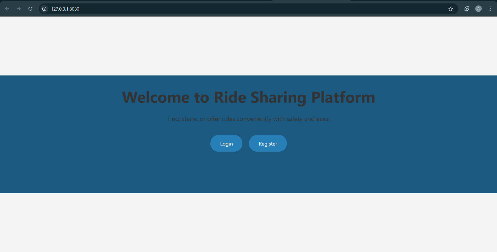
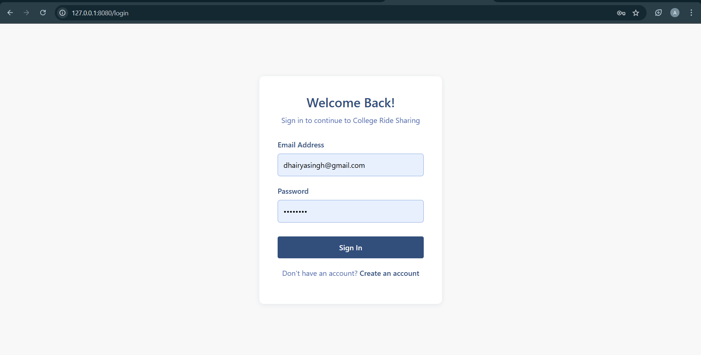
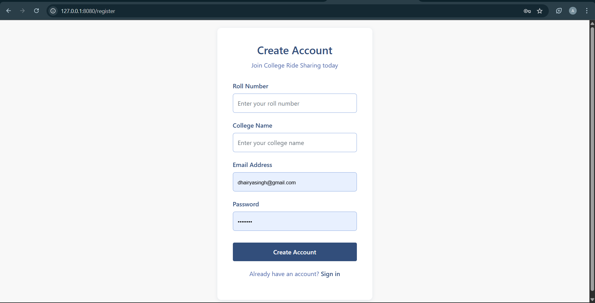
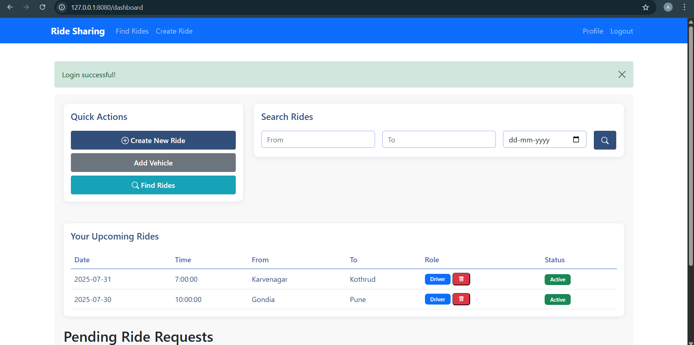
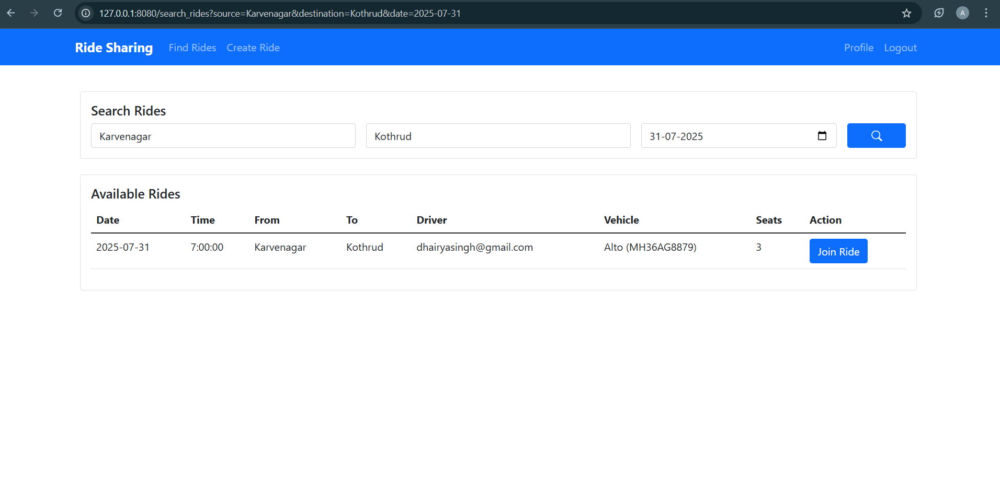
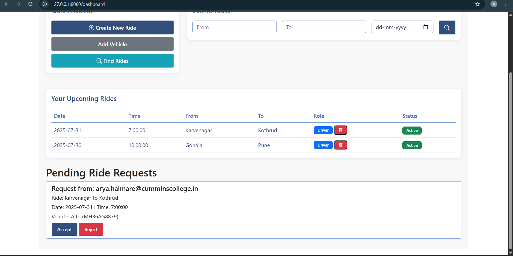

# Ride Sharing - Login System

A secure login and registration system for a college ride-sharing platform built with Flask and MySQL.

## Features

- User registration with roll number, college name, email, and password
- Secure password hashing using bcrypt
- User login with email and password
- Session management
- Responsive design
- Form validation
- Flash messages for user feedback

## Prerequisites

- Python 3.7 or higher
- MySQL Server
- pip (Python package manager)

## Setup Instructions

1. Clone the repository:
```bash
git clone <repository-url>
cd college-ride-sharing
```

2. Create a virtual environment and activate it:
```bash
python -m venv venv
# On Windows
venv\Scripts\activate
# On Unix or MacOS
source venv/bin/activate
```

3. Install the required packages:
```bash
pip install -r requirements.txt
```

4. Set up the MySQL database:
- Create a MySQL database named `ride_sharing`
- Run the SQL commands in `db.sql` to create the necessary tables

5. Configure the database connection:
- Open `app.py` and update the database configuration with your MySQL credentials:
```python
db_config = {
    'host': 'localhost',
    'user': 'your_username',
    'password': 'your_password',
    'database': 'ride_sharing'
}
```

6. Run the application:
```bash
python app.py
```

7. Open your web browser and navigate to:
```
http://localhost:5000
```

## Project Structure

```
college-ride-sharing/
├── app.py              # Flask application
├── db.sql             # Database schema
├── requirements.txt   # Python dependencies
├── static/           # Static files
│   ├── css/
│   │   └── style.css
│   └── js/
│       └── main.js
└── templates/        # HTML templates
    ├── base.html
    ├── login.html
    ├── register.html
    └── dashboard.html
```

## ScreenShots

###  Home Page


###  Login Page


###  Registration Page


### Dashboard Page


### Request Page


###  Request Page


###  Dashboard Page



## Security Features

- Passwords are hashed using bcrypt before storage
- Session management for authenticated users
- Input validation and sanitization
- Protection against SQL injection using parameterized queries
- CSRF protection (built into Flask)

## Contributing

1. Fork the repository
2. Create your feature branch
3. Commit your changes
4. Push to the branch
5. Create a new Pull Request
